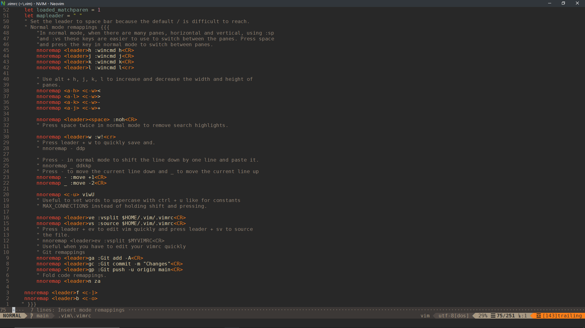

# ShankarCodes (Shankar) Vim files 2020
For help see [HELP.md](./HELP.md)\
This repository's url [https://github.com/ShankarCodes/vim-config](https://github.com/ShankarCodes/vim-config)
# Screenshots

# Installation
Download the .vimrc from this repository.\
Install [vim plug](https://github.com/junegunn/vim-plug)
Place the .vimrc in your .vim folder.\
Follow the given instructions and run :PlugInstall on opening vim.\
Preffered Font IBM Plex Mono.\
Get it from here [IBM Plex Mono](https://github.com/IBM/plex)\
Install powerline fonts for the status bar from [here](https://github.com/powerline/fonts)\
If you want to have nvim-qt in full screen mode add the ginit.vim to the appropriate folder.
# Windows
### For nvim users
Place the below lines in %LOCALAPPDATA%\Local\nvim\init.vim
```
set runtimepath^=~/.vim runtimepath+=~/.vim/after
let &packpath=&runtimepath
source ~/.vim/.vimrc
```
### For vim users
Place the below line in your $HOME\.vimrc
```
source ~/.vim/.vimrc
```
## \*nix
### For nvim users
Place the below lines in ~/.config/nvim/init.vim
```
set runtimepath^=~/.vim runtimepath+=~/.vim/after
let &packpath=&runtimepath
source ~/.vim/.vimrc
```
### For vim users
Place the below line in your $HOME/.vimrc
```
source ~/.vim/.vimrc
```
# LICENSE
MIT License

Copyright (C) 2021 ShankarCodes

Permission is hereby granted, free of charge, to any person obtaining a copy
of this software and associated documentation files (the "Software"), to deal
in the Software without restriction, including without limitation the rights
to use, copy, modify, merge, publish, distribute, sublicense, and/or sell
copies of the Software, and to permit persons to whom the Software is
furnished to do so, subject to the following conditions:

The above copyright notice and this permission notice shall be included in all
copies or substantial portions of the Software.

THE SOFTWARE IS PROVIDED "AS IS", WITHOUT WARRANTY OF ANY KIND, EXPRESS OR
IMPLIED, INCLUDING BUT NOT LIMITED TO THE WARRANTIES OF MERCHANTABILITY,
FITNESS FOR A PARTICULAR PURPOSE AND NONINFRINGEMENT. IN NO EVENT SHALL THE
AUTHORS OR COPYRIGHT HOLDERS BE LIABLE FOR ANY CLAIM, DAMAGES OR OTHER
LIABILITY, WHETHER IN AN ACTION OF CONTRACT, TORT OR OTHERWISE, ARISING FROM,
OUT OF OR IN CONNECTION WITH THE SOFTWARE OR THE USE OR OTHER DEALINGS IN THE
SOFTWARE.
